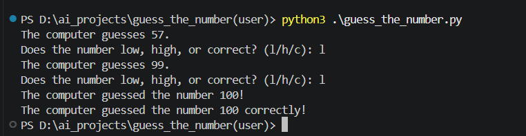

# Guess The Number - User Version

A simple Python game where you pick a number in your head, and the computer tries to guess it.

## Game Idea

The computer makes a guess between `1` and `100`. After each guess, you tell it whether your number is:

- Higher than the computer's guess: type `l`
- Lower than the computer's guess: type `h`
- Correct: type `c`

After every answer, the computer narrows the range and keeps guessing until it finds the correct number.

## Quick Example

```text
The computer guesses 37.
Does the number low, high, or correct? (l/h/c): l

The computer guesses 82.
Does the number low, high, or correct? (l/h/c): h

The computer guesses 64.
Does the number low, high, or correct? (l/h/c): c
The computer guessed the number 64 correctly!
```

## How To Run

Make sure Python is installed, then run:

```bash
python guess_the_number.py
```

Or from the project folder:

```bash
cd "guess_the_number(user)"
python guess_the_number.py
```

## Project Files

```text
guess_the_number(user)/
|-- guess_the_number.py
|-- screenshot.png
`-- README.md
```

## Screenshot



## Notes

- The game currently uses a fixed range from `1` to `100`.
- The accepted inputs are `l`, `h`, and `c`.
- If your number is higher than the computer's guess, type `l`.
- If your number is lower than the computer's guess, type `h`.

## Built With

- Python
- The built-in `random` module

## Have Fun

Pick a number, answer honestly, and see how many tries the computer needs to guess it.
